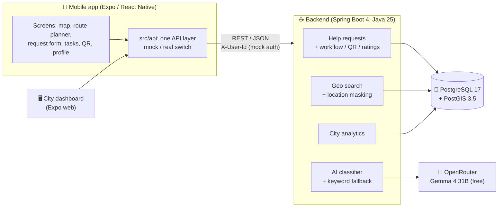

# PoDrodze 🚶‍♀️🏙️

**Neighbour help that's already on its way.**

PoDrodze ("on the way") connects people who need small, everyday help with volunteers who **already pass by on their daily commute** to work or university. Help happens without extra trips and without an extra carbon footprint, and privacy is built in from the start.

Built for **HackYeah 2026** · Smart City · Kraków

---

## The problem

Seniors, people with disabilities and people who are temporarily ill often need small things: medicine from the pharmacy, groceries, a borrowed ladder, a dripping tap fixed. Neighbour-help groups exist, but they have three problems:

- **Volunteers have to make a special trip**, which takes time and adds traffic.
- **Posting a public request with your address is unsafe**, especially for vulnerable people.
- **Cities have no data** on where these everyday needs cluster.

## Our solution

| | |
|---|---|
| 🤖 **AI triage** | A request written in plain Polish is classified by a **local LLM** (category, urgency 1–3, tags, risk flags). Requesters with special needs are prioritised automatically. Suspected scams are held back for review, and medical emergencies point the user to 112. |
| 🗺️ **Commute matching** | Volunteers see requests **near them** or **along their route home** (a corridor around the route line, computed in PostGIS). |
| 🔒 **Privacy by design** | Public views show only a **~300 m masked area**, never the address. The exact address unlocks only for the volunteer the requester accepted. Personal data detected by the AI is hidden from public views. |
| ✅ **Verified handoff** | The volunteer confirms delivery by scanning a **single-use, expiring QR code** on the requester's phone. |
| ⭐ **Trust & reputation** | Both sides rate each other. Trust scores, rating averages and city engagement points for volunteers update automatically. |
| 📊 **City dashboard** | A **hexagon heatmap** of needs across the city, built only from aggregated, anonymised data, to support urban planning. |

### Demo scenario

1. 👵 A requester writes: *"Skończyły mi się leki na serce, nie mam jak wyjść z domu."* ("I've run out of my heart medication and can't leave the house.")
2. 🤖 The AI marks it **critical (priority 1)** and adds tags.
3. 🗺️ It appears on the map as a blurred area, not a pin.
4. 🎓 A student enters their route home from university and sees the request right on their path.
5. 🤝 They offer help, the requester accepts, and **the exact address unlocks** for this volunteer only.
6. 📱 On arrival, the volunteer **scans the QR code** from the requester's phone, and the request is completed.
7. ⭐ Both sides rate each other, and the volunteer earns city points.
8. 📊 The city dashboard reflects the fulfilled request.

---

## Architecture



### Tech stack

| Layer | Technologies |
|---|---|
| **Mobile & web** | Expo SDK 57, React Native 0.86, Expo Router, TypeScript (strict), TanStack Query, `react-native-maps` (native) / Leaflet (web), `expo-camera`, `react-native-qrcode-svg` |
| **Backend** | Java 25, Spring Boot 4.1, Spring Data JPA, Hibernate Spatial (JTS), Bean Validation, RFC 9457 `ProblemDetail` errors |
| **Data** | PostgreSQL 17 + PostGIS 3.5 (Docker): `ST_DWithin` on `geography` for distances in metres, `ST_HexagonGrid` for the heatmap |
| **AI** | OpenRouter free models (`google/gemma-4-31b-it:free`, falling back to `qwen/qwen3.8-27b:free`), JSON-schema constrained output, keyword-based fallback |

---

## Repository structure

```
.
├── backend/hackyeah-2026-backend/   # Spring Boot API
│   ├── src/main/java/.../
│   │   ├── api/          # REST controllers + DTOs
│   │   ├── service/      # business logic: workflow, visibility, masking, reputation
│   │   ├── ai/           # LLM classifier, OpenRouter client, fallback
│   │   ├── analytics/    # heatmap + summary
│   │   ├── domain/       # JPA entities
│   │   └── config/       # Kraków demo data seeder, Jackson, schema helpers
│   ├── http/             # executable HTTP request collections (IntelliJ HTTP Client)
│   ├── docker-compose.yml
│   └── backend-plan.md   # backend design & progress (PL)
├── frontend/hackyeah-2026-app/     # Expo app (mobile + web)
│   └── src/
│       ├── app/          # Expo Router screens (thin)
│       ├── features/     # map, commute, requests, tasks, handoff (QR), dashboard, profile, auth
│       ├── api/          # API functions, types, mocks
│       └── components/   # shared UI
└── documentation/
    ├── plan.md               # MVP specification & team plan (PL)
    ├── api-contract.md       # frontend ⇄ backend API contract
    └── integration-plan.md   # integration roadmap
```

---

## Getting started

### Prerequisites

- **Docker** (for PostgreSQL + PostGIS)
- **Java 25** (the Maven wrapper is included)
- **Node.js 20+** and npm
- *Optional:* an **[OpenRouter](https://openrouter.ai/keys)** API key, for real AI classification. Without it, the backend uses the keyword-based fallback.
- *For the phone:* the **Expo Go** app

### 1. Backend

```bash
cd backend/hackyeah-2026-backend

# Database (PostgreSQL 17 + PostGIS)
docker compose up -d

# Optional: LLM via OpenRouter (secrets.properties is git-ignored)
cp secrets.properties.example secrets.properties   # then paste your key

# Run the API on http://localhost:8080
./mvnw spring-boot:run
# ...or without the LLM:
AI_ENABLED=false ./mvnw spring-boot:run
```

#### OpenRouter API key

The AI features (rewriting dictated requests and classifying them) call free models on [OpenRouter](https://openrouter.ai). Each developer brings their own key, and **the key must never be committed**.

1. Sign in at [openrouter.ai](https://openrouter.ai) and create a key at [openrouter.ai/keys](https://openrouter.ai/keys). Free models need no credits.
2. Give the key to the backend in one of two ways:
   - **File (recommended):** copy the template and paste your key:
     ```bash
     cp secrets.properties.example secrets.properties
     ```
     ```properties
     # secrets.properties
     app.ai.api-key=sk-or-v1-...
     ```
     `secrets.properties` is git-ignored and loaded automatically when the API is started from `backend/hackyeah-2026-backend`.
   - **Environment variable:** `OPENROUTER_API_KEY=sk-or-v1-... ./mvnw spring-boot:run`
3. Restart the API. If the key is missing or wrong, or OpenRouter is down, the backend logs a warning and uses the keyword-based fallback, so the app keeps working.

Free models are rate-limited: about 20 requests per minute and, on an account without credits, about 50 requests per day (1000 per day once you have bought $10 of credits). A voice request uses two calls (format + classify), so for a demo consider topping up or sharing one key that has credits.

On the first start with an empty database, the **Kraków demo data** is created automatically: 13 users and ~54 requests clustered in real districts and along a demo commute route, in every state of the lifecycle. To reset the demo data, run `docker compose down -v && docker compose up -d` and restart the API.

Check that it works: `curl http://localhost:8080/api/health` returns `{"status":"UP"}`.

<details>
<summary>Backend configuration (environment variables)</summary>

| Variable | Default | Purpose |
|---|---|---|
| `DB_HOST` / `DB_PORT` / `DB_NAME` | `localhost` / `5432` / `hackyeah` | Database connection |
| `DB_USER` / `DB_PASSWORD` | `hackyeah` / `hackyeah` | Database credentials |
| `AI_ENABLED` | `true` | `false` = keyword fallback only |
| `OPENROUTER_API_KEY` | *(empty)* | OpenRouter key; or set `app.ai.api-key` in `secrets.properties` |
| `OPENROUTER_MODELS` | `google/gemma-4-31b-it:free,qwen/qwen3.8-27b:free` | Models in order of preference |

</details>

### 2. Mobile app

```bash
cd frontend/hackyeah-2026-app
npm install
cp .env.example .env.local
npx expo start        # scan the QR code with Expo Go, or press "w" for the web version
```

| Variable in `.env.local` | Meaning |
|---|---|
| `EXPO_PUBLIC_USE_MOCKS` | `true` (default) = built-in demo data, no backend needed; `false` = live backend |
| `EXPO_PUBLIC_API_URL` | Backend URL. **Physical phone:** your computer's LAN IP, e.g. `http://192.168.0.10:8080`. **Android emulator:** `http://10.0.2.2:8080`. **iOS simulator / web:** `http://localhost:8080` |

Before committing, run `npm run check` (typecheck + lint).

### 3. Deploying to a server (Docker Compose)

The root `docker-compose.yml` builds and runs the whole stack: PostgreSQL + PostGIS, the API, and the Expo web app served by nginx. nginx also forwards `/api` to the backend, so **one public URL serves both the web app and the API**.

```bash
cp .env.example .env      # set POSTGRES_PASSWORD and OPENROUTER_API_KEY
docker compose up -d --build
curl http://localhost/api/health
```

Then build the mobile app against the server with `EXPO_PUBLIC_USE_MOCKS=false` and `EXPO_PUBLIC_API_URL=https://<your-domain>`, with no `/api` suffix. The web app is on the same port (`WEB_PORT`, default 80). For HTTPS, put your TLS proxy (Caddy, Traefik, nginx) in front of that port. The backend port is bound to `127.0.0.1` only.

### Demo accounts

Authentication is mocked for the hackathon: the user is chosen on the login screen, and API calls identify them with the `X-User-Id` header. Users in the Kraków seed:

| ID | User | Role |
|---|---|---|
| 1 | Anna K. | Requester (has special needs, so higher priority) |
| 2–8 | Marek S., Ewa P., Zofia M., Jan B., Halina R., Piotr N., Maria T. | Requesters |
| 9 | Kuba W. | Volunteer |
| 10–12 | Ola D., Bartek L., Nadia P. | Volunteers |
| 13 | Miasto Kraków | City admin (dashboard) |

---

## API overview

All endpoints are under `/api`. The full request and response shapes, validation rules and error codes are in **[`documentation/api-contract.md`](documentation/api-contract.md)**. Executable examples are in [`backend/hackyeah-2026-backend/http/`](backend/hackyeah-2026-backend/http/); [`help-requests-flow.http`](backend/hackyeah-2026-backend/http/help-requests-flow.http) walks through the whole demo flow with assertions.

| Area | Endpoints |
|---|---|
| Users | `GET /users/me` |
| AI | `POST /requests/classify`: preview of the AI classification |
| Requests | `POST /help-requests` · `GET /help-requests/{id}` (full or masked view, depending on role and status) · `GET /help-requests/mine` |
| Geo search | `GET /help-requests/nearby?lat&lng&radiusKm` · `POST /help-requests/along-route` |
| Workflow | `POST /help-requests/{id}/offer` · `/accept` · `/reject` · `/cancel` |
| QR handoff | `GET /help-requests/{id}/qr` · `POST /help-requests/{id}/complete` |
| Ratings | `POST /help-requests/{id}/ratings` |
| City analytics | `GET /analytics/heatmap` (GeoJSON hexagons) · `GET /analytics/summary` |

**Request lifecycle**

```
OPEN ──offer──► OFFERED ──accept──► ACCEPTED ──QR scan──► COMPLETED ──both rated──► RATED
  ▲               │                (address unlocked)
  └───reject──────┘            cancel (requester) ──► CANCELLED
create + AI flags a scam ──► UNDER_REVIEW (visible only to its author)
```

---

## Privacy & safety

- **No exact location in public data.** Lists, maps and public details only contain a ~300 m masked grid cell and its centre. Searches run on the real location; only the masked area is returned.
- **The address is revealed to one person, at one moment:** the volunteer the requester accepted, from acceptance onwards.
- **The AI protects users:**
  - When personal data is detected, the title is replaced with a generic one and the description is hidden.
  - Suspected scams (requests for BLIK codes or money transfers) are hidden from the public.
  - Tags containing digits are rejected, so phone numbers and PESEL numbers can't leak.
  - The LLM runs **locally**, so request texts never leave the server.
- **The QR handoff can't be forged or reused:** 256-bit random tokens, single-use, valid for 24 h, compared in constant time, and never included in API responses other than the requester's own QR endpoint.
- **No race conditions:** each request's state changes are handled one at a time, so two volunteers can never take the same request. This was tested with simultaneous offers.
- **Analytics are aggregated only:** counts per hexagon, with no personal data.
- **Automated "no leak" tests** search the raw JSON of public responses for addresses, names, phone numbers and exact coordinates.

---

## Testing

```bash
# Backend: unit, web-layer and PostGIS integration tests (needs the Docker database running)
cd backend/hackyeah-2026-backend && ./mvnw test

# Frontend: typecheck + lint
cd frontend/hackyeah-2026-app && npm run check
```

The backend has **160+ automated tests**. They cover the request workflow and QR token (reuse, expiry, permissions), privacy and data-masking rules, geo search on real PostGIS, AI response handling and the fallback, analytics, and reputation rules.

---

## Project status

| Area | Status |
|---|---|
| Geo search (radius and route corridor), location masking | ✅ Done |
| AI classification with local LLM + fallback, risk flags | ✅ Done |
| Request lifecycle: offer, accept, QR handoff, ratings, reputation | ✅ Done (backend) |
| City analytics API (heatmap, summary) | ✅ Done |
| Kraków demo data | ✅ Done |
| Mobile app: map, route planner, request form with AI preview, details, task board, QR display and scanner, rating, profile, web dashboard | ✅ Done (on demo data) |
| **Connecting the app to the live backend** | 🔄 In progress, see [`integration-plan.md`](documentation/integration-plan.md) |
| Real identity verification (mObywatel / Profil Zaufany) | 💡 Mocked for the hackathon |

The app currently runs on built-in demo data by default (`EXPO_PUBLIC_USE_MOCKS=true`). It has one API layer with a mock/real switch, and both sides follow a written [API contract](documentation/api-contract.md). The backend already supports the whole demo scenario end to end.

### What's next

- Finish connecting the app to the live backend (login accounts, data formats, request workflow screens).
- Use the device's location (or a map pin) when creating a request.
- A review queue for AI-flagged requests, for city moderators.
- District-level statistics on the dashboard.
- Real authentication and identity verification.

---

## Team

A six-person team: three backend developers (data & geo · business logic & handoff · AI & analytics) and three mobile developers (UI & routing · map & commute · QR scanner & city dashboard). See [`documentation/plan.md`](documentation/plan.md) for the plan we followed.
