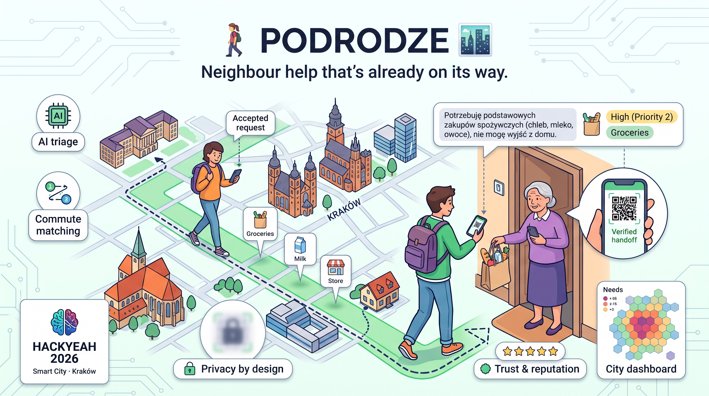
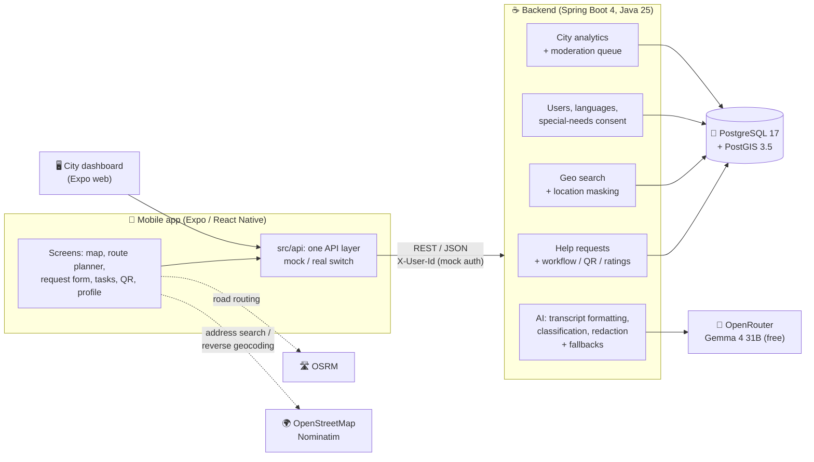

<p align="center">
  
</p>

# PoDrodze 🚶‍♀️🏙️

**Neighbour help that's already on its way.**

PoDrodze ("on the way") connects people who need small, everyday help with volunteers who **already pass by on their daily commute** to work or university. Help happens without extra trips and without an extra carbon footprint, and privacy is built in from the start.

Built for **HackYeah 2026** · Smart City · Kraków

---

## The problem

Seniors, people with disabilities and people who are temporarily ill often need small things: medicine from the pharmacy, groceries, a borrowed ladder, a dripping tap fixed. Neighbour-help groups exist, but they have three problems:

- **Volunteers have to make a special trip**, which takes time and adds traffic.
- **Posting a public request with your address is unsafe**, especially for vulnerable people.
- **Cities have no data** on where these everyday needs cluster.

## Our solution

| | |
|---|---|
| 🎙️ **Ask by voice** | Requesters can simply **say** what they need. A full-screen voice circle pulses with the sound, the AI turns a rambling transcript into a short title and a clear description, and the app can read requests aloud. Typing is always available too. |
| 🤖 **AI triage** | A request written in plain Polish is classified by an **LLM** (category, urgency, tags, risk flags). Requesters with special needs are prioritised automatically. Suspected scams are held back for review, and medical emergencies point the user to 112. |
| 🛡️ **Human review of AI flags** | Requests the AI suspects are scams (e.g. asking for a BLIK code or card details) are never published automatically. They wait in the city's **moderation queue**, where an administrator reads the text, sees the AI's warning and the requester's trust score, and **publishes or rejects** the request. The admin never sees the address. |
| 💊 **Safe medicine requests** | Requests about medication get a special priority, and their title and description are replaced with generic text, so medicine names never appear in public. Details are passed on in person. |
| 🗺️ **Commute matching** | Volunteers see requests **near them** or **along their route home**: real road routing, Kraków address and place search, and a corridor around the route computed in PostGIS. |
| 🔒 **Privacy by design** | Public views show only a **~300 m masked area**, never the address. The exact address unlocks only for the volunteer the requester accepted. Personal data detected by the AI is hidden from public views. |
| ♿ **Special needs, consent first** | Requesters can declare a disability (vision, hearing, mobility…) and notes in their own words (*"Nie słyszę pukania"*). This health data is stored **only with explicit consent**, shared **only with the accepted volunteer**, and deleted when the consent is withdrawn. |
| 👵 **Senior-friendly UI** | The first login step asks for an age group, and the app adjusts text size, colour palette, touch-target size and animations to it. |
| ✅ **Verified handoff** | The volunteer confirms delivery by scanning a **single-use, expiring QR code** on the requester's phone. |
| ⭐ **Trust & reputation** | Both sides rate each other. Trust scores, rating averages and city engagement points for volunteers update automatically. A volunteer takes **one active task at a time**, so no one over-commits. |
| 🔔 **Notifications** | In-app banners tell volunteers about new requests nearby, and tell requesters when someone offers help or an offer is accepted. |
| 📊 **City dashboard** | A **hexagon heatmap** on a real map of Kraków shows **where people are still waiting for help**, with views for help in progress and help delivered, and a category filter that applies to the whole panel. Each area shows how many requests it has, how many are still open and which categories they are. Key figures (needs reported, help delivered, in progress, still waiting and how many of those are urgent) sit above the map. Built only from aggregated data: areas are at least 500 m and areas with fewer than 3 requests are hidden. |

### Demo scenario

1. 👵 A requester taps the microphone and says: *"Dzień dobry, bo widzi pan, skończyły mi się leki na serce, a ja nie mam jak wyjść z domu…"* ("I've run out of my heart medication and can't leave the house.")
2. 🤖 The AI rewrites the transcript into a short request, recognises it as a **medicine** request, gives it the special priority and replaces the text with a generic one, so the medicine name stays private. The request is placed at the requester's current location.
3. 🗺️ It appears on the map as a blurred area, not a pin.
4. 🎓 A student enters their route home from university and sees the request right on their path.
5. 🤝 They offer help, the requester accepts, and **the exact address unlocks** for this volunteer only, together with the special needs the requester agreed to share (e.g. *"I can't hear knocking, please call"*).
6. 📱 On arrival, the volunteer **scans the QR code** from the requester's phone, and the request is completed.
7. ⭐ Both sides rate each other, and the volunteer earns city points.
8. 📊 The city dashboard reflects the fulfilled request. Its default view shows where people are still waiting, so the city can see which districts lack volunteers.
9. 🛡️ Meanwhile, someone posts *"Proszę o kod BLIK na 200 zł…"*. The AI holds it back as a possible scam, and it appears in the city admin's moderation queue with the AI's warning. The admin rejects it, so it is never published. A false alarm (*"chętnie oddam przelewem za wiertła"*) can be published with one tap.

---

## Architecture



For deployment, the whole stack (database, API and the web app behind nginx) runs from one `docker-compose.yml`, see [Deploying to a server](#3-deploying-to-a-server-docker-compose).

### Tech stack

| Layer | Technologies |
|---|---|
| **Mobile & web** | Expo SDK 57, React Native 0.86, Expo Router, TypeScript (strict), TanStack Query, `react-native-maps` (native) / Leaflet + OpenStreetMap (web), `expo-location`, `expo-speech-recognition` + Web Speech API, `expo-speech`, `expo-camera`, `react-native-qrcode-svg` |
| **Backend** | Java 25, Spring Boot 4.1, Spring Data JPA, Hibernate Spatial (JTS), Bean Validation, RFC 9457 `ProblemDetail` errors |
| **Data** | PostgreSQL 17 + PostGIS 3.5 (Docker): `ST_DWithin` on `geography` for distances in metres, `ST_HexagonGrid` for the heatmap |
| **AI** | OpenRouter free models (`google/gemma-4-31b-it:free`, falling back to `qwen/qwen3.8-27b:free`), JSON-schema constrained output, rule-based fallbacks for both formatting and classification |
| **Maps & geo services** | OSRM (road routing), OpenStreetMap Nominatim (reverse geocoding), built-in list of Kraków places |
| **Deployment & CI** | Docker Compose (PostgreSQL + API + nginx serving the Expo web export), GitHub Actions with Claude Code PR review |

---

## Repository structure

```
.
├── docker-compose.yml               # full stack for a server: DB + API + web app (nginx)
├── .env.example                     # settings for the full stack
├── .github/workflows/               # Claude Code PR assistant and code review
├── backend/hackyeah-2026-backend/   # Spring Boot API
│   ├── src/main/java/.../
│   │   ├── api/          # REST controllers + DTOs
│   │   ├── service/      # business logic: workflow, visibility, masking, reputation,
│   │   │                 # medicine policy, special-needs consent, moderation
│   │   ├── ai/           # OpenRouter client, transcript formatter, classifier, redaction, fallbacks
│   │   ├── analytics/    # heatmap + summary (privacy thresholds)
│   │   ├── domain/       # JPA entities
│   │   └── config/       # Kraków demo data seeder, CORS, Jackson, schema helpers
│   ├── src/main/resources/prompts/  # LLM prompts
│   ├── http/             # executable HTTP request collections (IntelliJ HTTP Client)
│   ├── docker-compose.yml  # database only, for local development
│   ├── Dockerfile
│   └── backend-plan.md   # backend design & progress (PL)
├── frontend/hackyeah-2026-app/     # Expo app (mobile + web)
│   ├── Dockerfile + docker/nginx.conf
│   └── src/
│       ├── app/          # Expo Router screens (thin)
│       ├── features/     # map, commute, requests, tasks, handoff (QR), dashboard, profile, auth,
│       │                 # voice, accessibility, notifications, home
│       ├── api/          # API functions, types, mocks, routing + geocoding
│       └── components/   # shared UI
└── documentation/
    ├── plan.md               # MVP specification & team plan (PL)
    ├── api-contract.md       # frontend ⇄ backend API contract
    ├── integration-plan.md   # integration roadmap
    └── dashboard-plan.md     # city dashboard & admin roadmap (done and open tasks)
```

---

## Getting started

### Prerequisites

- **Docker** (for PostgreSQL + PostGIS)
- **Java 25** (the Maven wrapper is included)
- **Node.js 20+** and npm
- *Optional:* an **[OpenRouter](https://openrouter.ai/keys)** API key, for real AI classification. Without it, the backend uses the keyword-based fallback.
- *For the phone:* the **Expo Go** app

### 1. Backend

```bash
cd backend/hackyeah-2026-backend

# Database (PostgreSQL 17 + PostGIS)
docker compose up -d

# Optional: LLM via OpenRouter (secrets.properties is git-ignored)
cp secrets.properties.example secrets.properties   # then paste your key

# Run the API on http://localhost:8080
./mvnw spring-boot:run
# ...or without the LLM:
AI_ENABLED=false ./mvnw spring-boot:run
```

#### OpenRouter API key

The AI features (rewriting dictated requests and classifying them) call free models on [OpenRouter](https://openrouter.ai). Each developer brings their own key, and **the key must never be committed**.

1. Sign in at [openrouter.ai](https://openrouter.ai) and create a key at [openrouter.ai/keys](https://openrouter.ai/keys). Free models need no credits.
2. Give the key to the backend in one of two ways:
   - **File (recommended):** copy the template and paste your key:
     ```bash
     cp secrets.properties.example secrets.properties
     ```
     ```properties
     # secrets.properties
     app.ai.api-key=sk-or-v1-...
     ```
     `secrets.properties` is git-ignored and loaded automatically when the API is started from `backend/hackyeah-2026-backend`.
   - **Environment variable:** `OPENROUTER_API_KEY=sk-or-v1-... ./mvnw spring-boot:run`
3. Restart the API. If the key is missing or wrong, or OpenRouter is down, the backend logs a warning and uses the keyword-based fallback, so the app keeps working.

Free models are rate-limited: about 20 requests per minute and, on an account without credits, about 50 requests per day (1000 per day once you have bought $10 of credits). A voice request uses two calls (format + classify), so for a demo consider topping up or sharing one key that has credits.

On the first start with an empty database, the **Kraków demo data** is created automatically: 13 users and 65 requests clustered in real districts and along a demo commute route, in every state of the lifecycle, including 3 requests held back for the moderation queue (two scams and one false alarm). To reset the demo data, run `docker compose down -v && docker compose up -d` and restart the API.

Check that it works: `curl http://localhost:8080/api/health` returns `{"status":"UP"}`.

<details>
<summary>Backend configuration (environment variables)</summary>

| Variable | Default | Purpose |
|---|---|---|
| `DB_HOST` / `DB_PORT` / `DB_NAME` | `localhost` / `5432` / `hackyeah` | Database connection |
| `DB_USER` / `DB_PASSWORD` | `hackyeah` / `hackyeah` | Database credentials |
| `AI_ENABLED` | `true` | `false` = keyword fallback only |
| `OPENROUTER_API_KEY` | *(empty)* | OpenRouter key; or set `app.ai.api-key` in `secrets.properties` |
| `OPENROUTER_MODELS` | `google/gemma-4-31b-it:free,qwen/qwen3.8-27b:free` | Models in order of preference |
| `ANALYTICS_MIN_CELL_COUNT` | `3` | Heatmap areas with fewer requests are hidden (k-anonymity) |

</details>

### 2. Mobile app

```bash
cd frontend/hackyeah-2026-app
npm install
cp .env.example .env.local
npx expo start        # scan the QR code with Expo Go, or press "w" for the web version
```

| Variable in `.env.local` | Meaning |
|---|---|
| `EXPO_PUBLIC_USE_MOCKS` | `true` (default) = built-in demo data, no backend needed; `false` = live backend |
| `EXPO_PUBLIC_API_URL` | Backend URL. **Physical phone:** your computer's LAN IP, e.g. `http://192.168.0.10:8080`. **Android emulator:** `http://10.0.2.2:8080`. **iOS simulator / web:** `http://localhost:8080` |

Before committing, run `npm run check` (typecheck + lint).

### 3. Deploying to a server (Docker Compose)

The root `docker-compose.yml` builds and runs the whole stack: PostgreSQL + PostGIS, the API, and the Expo web app served by nginx. nginx also forwards `/api` to the backend, so **one public URL serves both the web app and the API**.

```bash
cp .env.example .env      # set POSTGRES_PASSWORD and OPENROUTER_API_KEY
docker compose up -d --build
curl http://localhost/api/health
```

Then build the mobile app against the server with `EXPO_PUBLIC_USE_MOCKS=false` and `EXPO_PUBLIC_API_URL=https://<your-domain>`, with no `/api` suffix. The web app is on the same port (`WEB_PORT`, default 80). For HTTPS, put your TLS proxy (Caddy, Traefik, nginx) in front of that port. The backend port is bound to `127.0.0.1` only.

### Demo accounts

Authentication is mocked for the hackathon: the user is chosen on the login screen, and API calls identify them with the `X-User-Id` header. Users in the Kraków seed:

| ID | User | Role |
|---|---|---|
| 1 | Anna K. | Requester with special needs (chronic illness, consent given), so higher priority |
| 4 | Zofia M. | Requester with special needs (vision) |
| 6 | Halina R. | Requester with special needs (hearing, mobility) |
| 2, 3, 5, 7, 8 | Marek S., Ewa P., Jan B., Piotr N., Maria T. | Requesters |
| 9 | Kuba W. | Volunteer with no active task (the account to use for the demo) |
| 10–12 | Ola D., Bartek L., Nadia P. | Volunteers (Ola has an open offer, Bartek an accepted task) |
| 13 | Miasto Kraków | City admin: dashboard and moderation queue (the only account that can use them) |

Every user also has spoken languages (e.g. Nadia speaks Ukrainian, Russian and Polish), shown on their profile.

---

## API overview

All endpoints are under `/api`. The full request and response shapes, validation rules and error codes are in **[`documentation/api-contract.md`](documentation/api-contract.md)**. Executable examples are in [`backend/hackyeah-2026-backend/http/`](backend/hackyeah-2026-backend/http/); [`help-requests-flow.http`](backend/hackyeah-2026-backend/http/help-requests-flow.http) walks through the whole demo flow with assertions, and [`admin.http`](backend/hackyeah-2026-backend/http/admin.http) through moderation.

| Area | Endpoints |
|---|---|
| Users | `GET /users/me` · `GET /users/demo` (accounts for the login screen) · `PUT /users/me/languages` |
| Special needs | `PUT /users/me/special-needs-consent` · `PUT /users/me/disabilities` · `PUT /users/me/special-need-notes` (requesters only; data only with consent) |
| AI | `POST /requests/format-transcript`: turns a voice transcript into a title + description · `POST /requests/classify`: preview of the AI classification |
| Requests | `POST /help-requests` · `GET /help-requests/{id}` (full or masked view, depending on role and status) · `GET /help-requests/mine` |
| Geo search | `GET /help-requests/nearby?lat&lng&radiusKm` · `POST /help-requests/along-route` |
| Workflow | `POST /help-requests/{id}/offer` · `/accept` · `/reject` · `/cancel` |
| QR handoff | `GET /help-requests/{id}/qr` · `POST /help-requests/{id}/complete` |
| Ratings | `POST /help-requests/{id}/ratings` |
| City analytics (city admin only) | `GET /analytics/heatmap` (GeoJSON hexagons; filter by category, status and time) · `GET /analytics/summary` |
| Moderation (city admin only) | `GET /admin/review-queue` · `POST /admin/help-requests/{id}/approve` · `/dismiss` |

**Request lifecycle**

```
OPEN ──offer──► OFFERED ──accept──► ACCEPTED ──QR scan──► COMPLETED ──both rated──► RATED
  ▲               │                (address unlocked)
  └───reject──────┘            cancel (requester) ──► CANCELLED
create + AI flags a scam ──► UNDER_REVIEW (visible only to its author and the moderation queue)
UNDER_REVIEW ──approve (city admin)──► OPEN        UNDER_REVIEW ──dismiss (city admin)──► CANCELLED
```

A volunteer can have only **one** request in `OFFERED` or `ACCEPTED` at a time; another offer returns `409 Conflict`.

---

## Privacy & safety

- **No exact location in public data.** Lists, maps and public details only contain a ~300 m masked grid cell and its centre. Searches run on the real location; only the masked area is returned.
- **The address is revealed to one person, at one moment:** the volunteer the requester accepted, from acceptance onwards.
- **The AI protects users:**
  - When personal data is detected, the title is replaced with a generic one and the description is hidden.
  - Medicine requests are stored with generic text only; the medicine itself is discussed in person.
  - Suspected scams (requests for BLIK codes or money transfers) are hidden from the public until a city administrator approves them; rejected ones are never published. The administrator sees the text needed to judge the request, but only the masked area, never the address. Who decided and when is stored with the request.
  - Tags containing digits are rejected, and sentences with phone or PESEL numbers are dropped from formatted voice transcripts, so they can't leak.
  - Request texts are sent to the LLM through OpenRouter. Without an API key, or with `AI_ENABLED=false`, nothing leaves the server and rule-based fallbacks are used.
- **Special needs are health data (GDPR art. 9).** They are stored only with a consent record, never shown in public views or lists, shared only with the accepted volunteer, and deleted together with the consent when it is withdrawn.
- **The QR handoff can't be forged or reused:** 256-bit random tokens, single-use, valid for 24 h, compared in constant time, and never included in API responses other than the requester's own QR endpoint.
- **No race conditions:** each request's state changes are handled one at a time, so two volunteers can never take the same request. This was tested with simultaneous offers.
- **Analytics are aggregated only, and only for city administrators:** counts per hexagon, with no personal data. Hexagons are at least 500 m (coarser than the ~300 m public masking), and hexagons with fewer than 3 requests are hidden, so no filter can single out one person's request.
- **Automated "no leak" tests** search the raw JSON of public responses for addresses, names, phone numbers and exact coordinates.

---

## Testing

```bash
# Backend: unit, web-layer and PostGIS integration tests (needs the Docker database running)
cd backend/hackyeah-2026-backend && ./mvnw test

# Frontend: typecheck + lint
cd frontend/hackyeah-2026-app && npm run check
```

The backend has **250+ automated tests**. They cover the request workflow and QR token (reuse, expiry, permissions, one active task per volunteer), privacy and data-masking rules, special-needs consent (including withdrawal on the real database), geo search on real PostGIS, AI response handling, transcript formatting, medicine redaction and the fallbacks, CORS, analytics (including the privacy thresholds on real PostGIS), moderation and admin-only access, and reputation rules.

---

## Project status

| Area | Status |
|---|---|
| Geo search (radius and route corridor), location masking | ✅ Done |
| AI: voice transcript formatting, classification, medicine redaction, risk flags, fallbacks (OpenRouter) | ✅ Done |
| Request lifecycle: offer, accept, QR handoff, ratings, reputation, one active task per volunteer | ✅ Done |
| Special needs: consent record, disabilities, own-words notes, sharing with the accepted volunteer | ✅ Done |
| User languages | ✅ Done |
| City analytics: hexagon heatmap with privacy thresholds, unmet-need view, per-area details, key figures | ✅ Done |
| Moderation queue for AI-flagged requests (city admin) | ✅ Done |
| Kraków demo data | ✅ Done |
| Mobile & web app: voice-first requester start screen, map with clustering and radius filter, route planner with road routing and place search, request form with current location and AI preview, request list with filters and sorting, task board, QR display and scanner, rating, profile, age-based accessibility, in-app notifications, city dashboard | ✅ Done |
| App ⇄ backend integration (one API layer with a mock/real switch, following the [API contract](documentation/api-contract.md)) | ✅ Done |
| Deployment with Docker Compose | ✅ Done |
| Sign-up of new users | 🧪 Works on demo data only (no backend endpoint yet) |
| Push notifications | 🧪 Simulated with in-app banners (polling) |
| Real identity verification (mObywatel / Profil Zaufany) | 💡 Mocked for the hackathon |

The app still starts on built-in demo data by default (`EXPO_PUBLIC_USE_MOCKS=true`), so it can be shown without a backend. Set it to `false` to use the live API.

### What's next

- Sign-up on the backend and real authentication with identity verification.
- Real push notifications instead of polling.
- Dashboard trends over time: demo data spread over 30 days, a time range filter and per-category trends (see [`documentation/dashboard-plan.md`](documentation/dashboard-plan.md)).
- District-level statistics on the dashboard.
- Telling the requester when the city rejected their request, instead of showing it as cancelled.

---

## Team

A six-person team: three backend developers (data & geo · business logic & handoff · AI & analytics) and three mobile developers (UI & routing · map & commute · QR scanner & city dashboard). See [`documentation/plan.md`](documentation/plan.md) for the plan we followed.
